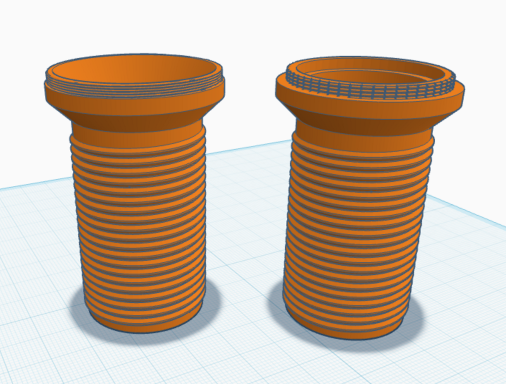
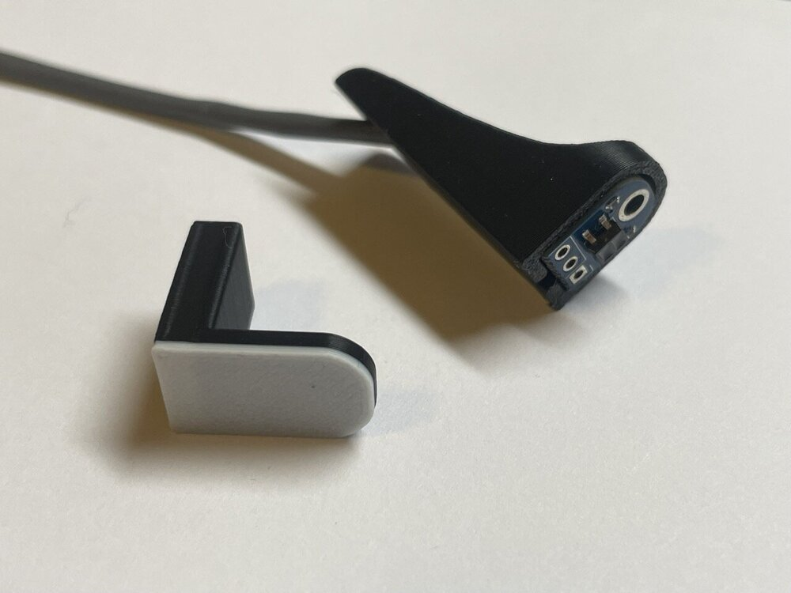
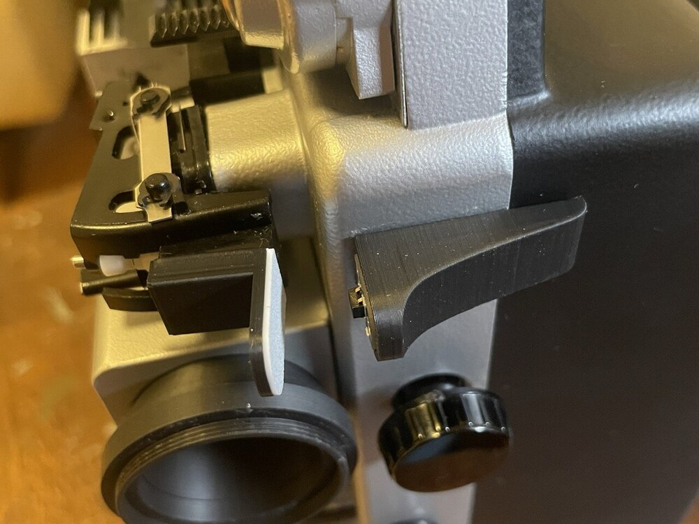
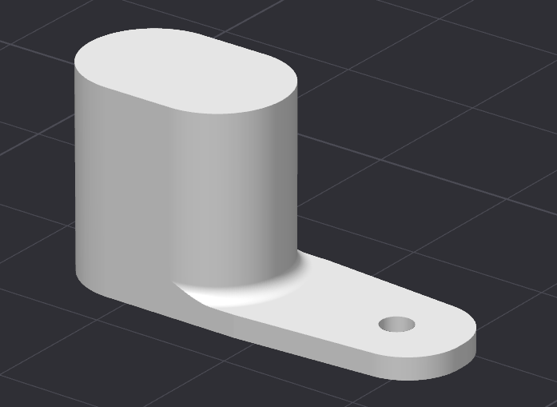

## (Optional) 3D parts for lucky owners of a 3D printer

This directory contains some 3D printable parts for convenience and beauty, contributed by others. Thanks a ton for this, feel free to send any other parts you might create (or just raise a PR).

### Noris specific parts

These tubes fit right into the Noris Lens holder and make destroying the original lense obsolete. Their other end can be screwed into a Nikor enlarger lens (or any other lens with a M37 resp M40.5 fiilter hodler resp. adapter)

These parts simplify mounting the film end detector on the projector. 

Holder for the motor shaft sensor. The Fusion file contains parameters that can be adjusted as desired to customize the holder. For example, the length of the holding arm or the spacer. Smoothing the top layer when printing is recommended, this ensures that the spacer fits nicely.

### Macro Focus Unit

Sebastian wrote: 

_"Since I wanted the setup to be as portable as possible, I decided not to use a base plate for the scanner. So I needed a solution for focusing and a support to prevent mechanical vibrations from being transmitted to the camera._

_For focusing, I decided to cut the tube (or macro tube) that sits between the M39 mount and the camera, add a reverse thread to it, and connect both parts so they can slide along a carriage. A threaded adapter sleeve allows for very precise focusing._

_To prevent wobbling, the entire assembly is supported diagonally against the housing. At the upper end of the support, beneath the focusing unit, there is a movable slide, allowing the camera’s vertical axis to be finely adjusted by applying more or less upward pressure. The camera is screwed onto the back."_

