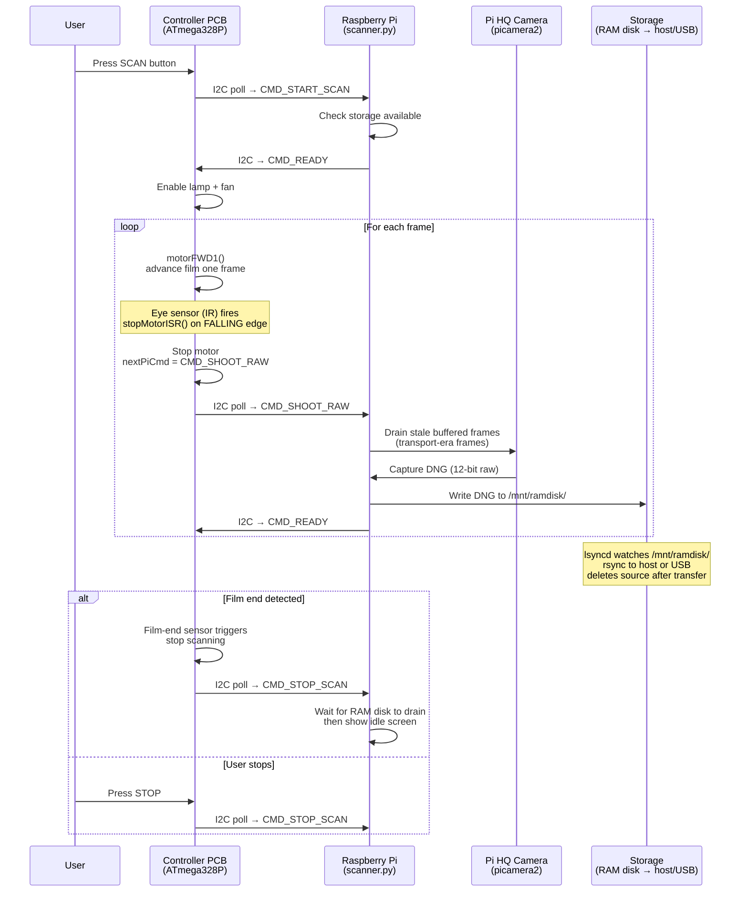

# Architecture

## System Roles

### Raspberry Pi — Camera and Brain

The Raspi is the central coordinator. It runs `scanner.py`, a Python application that:

- Controls the Pi HQ Camera (IMX477) via **picamera2**, capturing 12-bit DNG raw frames at up to 4K (4056×3040) or 2K (2028×1520).
- Drives an **HDMI overlay UI** (PIL/ImageDraw rendered to DRM framebuffer via tty1) for live preview and status display.
- Communicates with the Controller PCB via **I2C** (bus 1, address 0x2A), and polling it during scanning.
- Manages **file sync**: captured frames land in a RAM disk (`/mnt/ramdisk`), from which lsyncd moves them to the host Mac over Ethernet or to a local USB drive.
- Handles **OTA firmware updates**, SSH pairing, WiFi captive portal for network setup, and sleep/wake power management.

### Controller PCB — Hardware Interface

The PCB is built around an **ATmega328P** (Pretty much an Arduino Pro Mini at 3.3V and 8 MHz). It owns everything physical:

- **Film transport motor** — PWM-driven forward/reverse with a calibrated minimum duty cycle to guarantee movement from rest.
- **Eye sensor** (IR on GPIO2) — watches the main shaft and detectes a finished revolution via hardware interrupt (`stopMotorISR`). The ISR stops the motor and sets `CMD_SHOOT_RAW` for the next I2C poll from the Pi.
- **Film-end sensor** (GPIO3) — detects when the film strip runs out and stops scanning.
- **Lamp and fan** control (GPIO9, GPIO8).
- **Buttons and potentiometers** (analog pins A0–A3, A6) — navigation buttons, step/continuous speed knobs, exposure pot.
- **Board revision detection** (A7) — voltage divider that identifies PCB revision at runtime.

The firmware acts as an I2C slave. The Pi polls it; the controller queues one command at a time in `nextPiCmd` and returns it on the next `Wire.onRequest()` call.

### Host Computer — Optional Storage (macOS)

The host Mac is entirely optional. When paired over Ethernet:

- Receives DNG files from the Raspi in real time via **lsyncd + rsync** (rsync 3.x, SSH over eth0 only).
- Source files on the RAM disk are deleted after a successful transfer (`--remove-source-files`), keeping RAM usage flat.
- Hosts the **pairing scripts** (`host-computer/`) that establish SSH trust, configure file sync paths, and install the Remote Login prerequisite.

Without a paired host, scans go to a USB drive mounted at `/mnt/usb`.

---

## systemd Services

| Service | Type | Role |
|---|---|---|
| `filmkorn-ramdisk` | oneshot | Creates and mounts the RAM disk at `/mnt/ramdisk`; must be running before the scanner starts |
| `filmkorn-scanner` | simple | Main Python application — camera, I2C, UI, file routing. Restarts on failure. Requires `filmkorn-ramdisk` |
| `filmkorn-lsyncd` | simple | Runs lsyncd to sync `/mnt/ramdisk/` → host Mac (net) or `/mnt/usb/` (local). Config symlinked via `lsyncd.active.conf` |
| `filmkorn-firstboot` | oneshot | One-time setup on first boot: SSH host key generation, swap config, rootfs expansion |
| `filmkorn-sleep` | oneshot | Triggered by scanner.py to power down non-essential hardware for idle sleep |
| `filmkorn-wake` | oneshot | Triggered on wake to restore hardware state |
| `filmkorn-otp-schedule` | oneshot | Sets a timer to revoke the WiFi pairing OTP after its expiry window |
| `usb-mount-largest@` | oneshot | Udev-triggered: mounts the largest partition of a plugged-in USB drive to `/mnt/usb` |
| `usb-umount@` | oneshot | Udev-triggered: unmounts and syncs the USB drive on removal |

---

## Scanning Flow

### Key timing detail

The camera runs continuously in a ring buffer (`buffer_count=4`). When `CMD_SHOOT_RAW` arrives, the film has just stopped but the buffer still holds frames captured while it was moving ("transport-era frames"). `scanner.py` discards these before saving — using either a frame-count strategy (fast shutters) or a fixed settle + shutter-duration wait (slow shutters > 1/100 s). A user-adjustable "capture latency" setting controls how many additional frames are discarded as a safety margin.
